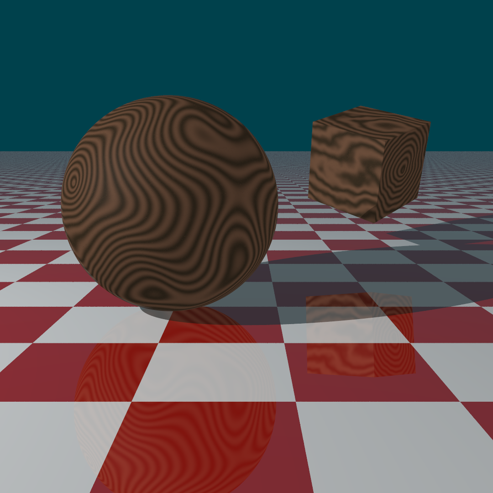

# Extension: Wooden3DTexture ( + 3D PerlinNoise)

### Author: Jan Matějka

### Category: Texture

### Namespace: Rendering.JanMatejka

### Class name: WoodenTexture : ITexture

### ITimeDependent: No

### Source file: WoodenTexture.cs, PerlinNoise.cs

A simple 3D texture simulating the structure of wood. This texture is deterministically generated according to a seed, and other parameters, using Perlin Noise function in three dimensions.

When creating a new instance of this texture, a user can input a seed, two colors (it is best to use 2 shades of a color) which the texture will use, coefficient called LineFrequency which determines the amount of "wood lines" in the texture, then octaves, persistence and distortion which together define how noisy, distorted and regular or irregular the "wood lines" will be. It adds another opportunity to create random patterns (together with the seed). Example images with different variable settings are down below.

Note: This extension contains PerlinNoise.cs which can be used independently. Usage info at the end of the document.

#### Usage
##### Scene snippet example
```
using Rendering.JanMatejka;

...

// Sphere
Sphere s = new Sphere();
root.InsertChild(s, Matrix4d.CreateRotationY(0.785398163) * Matrix4d.CreateRotationX(0.34906585));
s.SetAttribute(PropertyName.TEXTURE, new WoodenTexture(50, 8, 0.7, 0.1));
s.SetAttribute(PropertyName.MATERIAL, new PhongMaterial(new double[] { 1.0, 0.8, 0.1 }, 0.1, 0.1, 0.01, 5));

// Cube
Cube c = new Cube();
root.InsertChild(c, Matrix4d.CreateRotationY(5.49778714) * Matrix4d.CreateRotationX(5.93411946) * Matrix4d.Scale(1.2) * Matrix4d.CreateTranslation(2.5, -0.5, 2.4));
c.SetAttribute(PropertyName.TEXTURE, new WoodenTexture(50, 8, 0.2, 0.2));
c.SetAttribute(PropertyName.MATERIAL, new PhongMaterial(new double[] { 1.0, 0.8, 0.1 }, 0.1, 0.1, 0.01, 5));
```
There are several constructors that you can use: 
* ``WoodenTexture (int seed = 1337)``
  * This uses default values for all the other arguments.
* ``WoodenTexture (double lineFrequency, int octaves, double persistence, double distortion, int seed = 1337)``
* ``WoodenTexture (double[] firstColor, double[] secondColor, int seed = 1337)``
* ``WoodenTexture (double[] firstColor, double[] secondColor, double lineFrequency, int octaves, double persistence, double distortion, int seed = 1337)``

### Image examples
Seed is default (1337).

Parameters:
* Sphere
  * LineFrequency = 50
  * Octaves = 8
  * Persistence = 0.7
  * Distortion = 0.1
* Cube
  * LineFrequency = 50
  * Octaves = 8
  * Persistence = 0.2
  * Distortion = 0.2


Parameters:
* Sphere
  * LineFrequency = 70
  * Octaves = 4
  * Persistence = 0.8
  * Distortion = 0.15
* Cube
  * LineFrequency = 50
  * Octaves = 8
  * Persistence = 0.7
  * Distortion = 0.1



Parameters:
* Sphere
  * LineFrequency = 50
  * Octaves = 4
  * Persistence = 0.8
  * Distortion = 0.3
* Cube
  * LineFrequency = 50
  * Octaves = 4
  * Persistence = 0.8
  * Distortion = 0.3


### PerlinNoise Usage
``PerlinNoise`` class has a constructor ``PerlinNoise (int seed = 1337)``. Different seeds generate different results (deterministically). After constructing ``PerlinNoise``, you can use either ``Noise (double x, double y, double z)`` to get noise value between -1.0 and 1.0, or another way to get noise is to use ``OctavesNoise(double x, double y, double z, int octaves = 8, double perstistence = 0.5)`` which calls the Noise function several times and accumulates the return values.