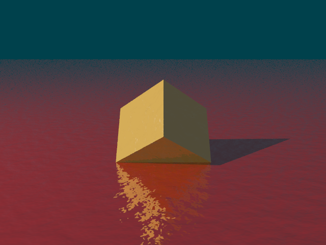

# Extension: PerlinNoise



### Author: Vojtech Cerny

### Category: Functionality

### Namespace: VojtechCerny

### Class name: PerlinNoise : INoiseWithGradient

### ITimeDependent: No

### Source file: PerlinNoise.cs

An implementation of 2D Perlin Noise, which is useful for procedural textures (colors / bump-maps), procedural terrain, effects and more.

Paramaters:
1. numOctaves - number of octaves to use internally. Larger number increases the amount of small details.
2. frequencyMultiplier - how much is the frequency (of the gradient grid) multiplied with each octave.
   Reasonable values: 1.4 - 3.0 (2.0 usually works well)
3. amplitudeMultiplier - how much is the amplitude (of output) multiplied with each octave.
   Reasonable values: 0.3 - 0.8 (0.5 usuall works well)
4. baseFrequency - frequency of first octave. Default 1.0
5. baseAmplitude - amplitude of first octave. Default 1.0
6. isNormalized - if true, the noise will be scaled to the <-1, 1> interval. Note however, that with more octaves the noise will rarely
   come even close to these limits.

The solution comes with INoise and INoiseWithGradient interfaces, which you can use when implementing custom noise functions and have a common parent.

Example implementation of a bump-map texture (ready-to-use) is given in NoiseBumpMap, and simplistic color texture is implemented in NoiseTexture.

## Example

From a scene/animation definition script
```csharp
using VojtechCerny;

PerlinNoise noiseGenerator = new PerlinNoise(6, 2.0, 0.5);
Plane plane = new Plane(-20, 20, -30, 30);
plane.SetAttribute(PropertyName.TEXTURE, new NoiseBumpMap(noiseGenerator, 0.05));
```

### Sample scene script: NoiseScene.csx
